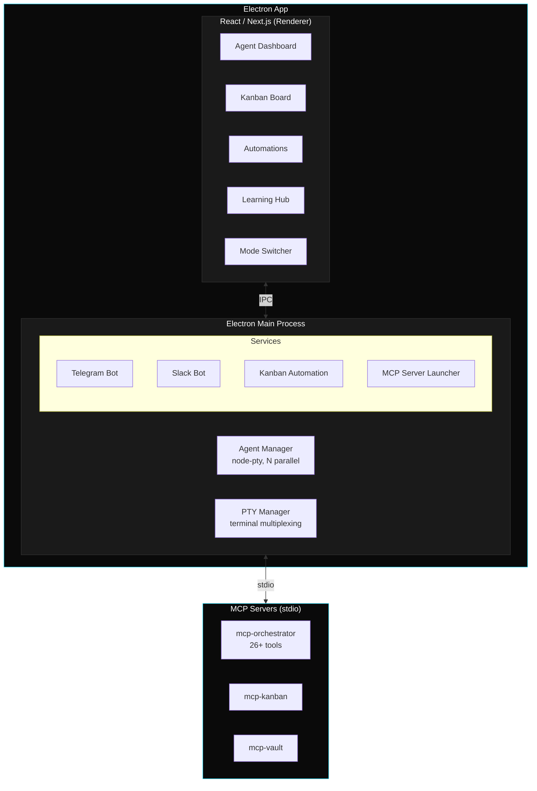
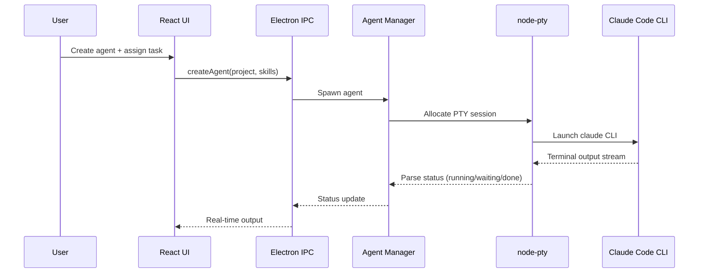

# GRIP Commander

Cross-domain knowledge work engine. Run, orchestrate, and automate Claude Code agents from one interface.

**Electron 33 + Next.js 16 + React 19**

[](https://github.com/CodeTonight-SA/GRIP-GUI/releases)
[](LICENSE)
[](https://github.com/CodeTonight-SA/GRIP-GUI/actions)

---

## Download

Latest release: [**github.com/CodeTonight-SA/GRIP-GUI/releases/latest**](https://github.com/CodeTonight-SA/GRIP-GUI/releases/latest)

| Platform | Architecture | File |
|----------|-------------|------|
| macOS | ARM64 (Apple Silicon) | `GRIP-Commander-<version>-arm64.dmg` |
| macOS | x64 (Intel) | `GRIP-Commander-<version>-x64.dmg` |
| Windows | x64 | `GRIP-Commander-<version>-x64-setup.exe` |
| Linux | x64 | `GRIP-Commander-<version>-x86_64.AppImage` |

> **Unsigned build.** First launch needs one manual step to get past OS security. See [First-time launch](#first-time-launch) below.

---

## First-time launch

GRIP Commander is distributed unsigned (no Apple Developer certificate, no Microsoft Authenticode signature). Your OS will block the first launch until you explicitly allow it. Pick the path for your platform.

### macOS (Apple Silicon or Intel)

When you double-click the app the first time you'll see:

> **"GRIP Commander" is damaged and can't be opened. You should move it to the Trash.**

The app isn't damaged — macOS Gatekeeper is blocking an unsigned download. Two ways to unblock:

**Option A — Terminal (fastest)**

```bash
xattr -cr "/Applications/GRIP Commander.app"
```

Then re-launch. Strips the `com.apple.quarantine` flag so Gatekeeper stops blocking.

**Option B — System Settings (no Terminal)**

1. Double-click the app — it fails with the "damaged" message.
2. Open **System Settings → Privacy & Security**.
3. Scroll to the bottom. You'll see *"GRIP Commander was blocked from use because it is not from an identified developer."*
4. Click **Open Anyway** and confirm.
5. The next launch prompts once more, then it works from then on.

### Windows

Running `GRIP-Commander-<version>-x64-setup.exe` will show a SmartScreen warning:

> **Windows protected your PC** — Microsoft Defender SmartScreen prevented an unrecognised app from starting.

Click **More info** → **Run anyway**. This happens once per version.

### Linux

Make the AppImage executable, then run it:

```bash
chmod +x GRIP-Commander-<version>-x86_64.AppImage
./GRIP-Commander-<version>-x86_64.AppImage
```

Some distros need `libfuse2` installed for AppImages:

```bash
sudo apt install libfuse2         # Ubuntu/Debian
sudo dnf install fuse-libs        # Fedora/RHEL
```

### Why unsigned?

Code signing requires paid developer accounts on each platform (Apple Developer Program $99/year, Microsoft Authenticode cert ~$300+/year). We'll move to signed + notarised builds before the 1.0 release. Until then, the steps above are the one-time friction per version.

---

## What It Does

Claude Code runs one agent at a time, in one terminal. GRIP Commander removes that limitation.

- **Parallel agents** — run 10+ agents simultaneously across different projects
- **Orchestration** — a Super Agent delegates, monitors, and coordinates work via MCP tools
- **Automations** — trigger agents on GitHub PRs, JIRA issues, and external events
- **Kanban** — visual task board with automatic agent assignment
- **Scheduling** — cron-based tasks that run autonomously

---

## What's Included

### Starter Pack (ships with Commander)

GRIP Commander includes a curated subset of the GRIP ecosystem that works out of the box.

| Component | Count | Includes |
|-----------|-------|---------|
| Skills | 15 | code-mode, testing-mode, review-mode, architect-mode, research-mode, design-principles, PR automation, session resume, context refresh, preplan |
| Agents | 5 | context-refresh, direct-implementation, PR workflow, Explore, efficiency-auditor |
| Safety hooks | 5 | confidence-gate, context-gate, dependency-guardian, destructive-git, secrets-detection |
| CLI | 2 | `grip` (session manager), `grip-ut` (extended thinking wrapper) |

### Full GRIP (by invitation)

The complete GRIP operating system — 194 skills, 30 agents, 34 safety hooks, 25 convergence modules, evolutionary genome, KONO semantic memory, Broly meta-agent, and scientific measurement protocol.

**This is a taste. [Request an invitation](https://grip-preview.vercel.app#invite) for a full 90-day evaluation.**

---

## Architecture

### System Overview


<details>
<summary>Mermaid source</summary>



</details>

### Agent Execution Flow


<details>
<summary>Mermaid source</summary>



</details>

---

## Core Concepts

### Parallel Agent Management

Each agent runs in its own isolated PTY terminal session. Agents operate independently across different projects, codebases, and tasks. State persists across app restarts.

```
Agent lifecycle: idle → running → completed / error / waiting
```

### Super Agent

A meta-agent that controls other agents programmatically. Give it a high-level task — it creates agents, delegates work, monitors progress, and handles errors.

### Automations

Poll external sources (GitHub, JIRA), detect new items, spawn temporary agents to process each item, deliver results (Telegram, Slack, GitHub comments), clean up.

### MCP Servers

GRIP Commander bundles MCP servers for programmatic control:

| Server | Purpose |
|--------|---------|
| mcp-orchestrator | Agent management, messaging, scheduling, automations (26+ tools) |
| mcp-kanban | Task board CRUD |
| mcp-vault | Persistent document storage with FTS5 search |

---

## Tech Stack

| | |
|---|---|
| **Frontend** | Next.js 16, React 19, Tailwind CSS 4, Zustand 5, Framer Motion |
| **Desktop** | Electron 33, node-pty, xterm.js |
| **Database** | better-sqlite3 |
| **Protocol** | MCP (Model Context Protocol) via stdio |
| **Language** | TypeScript 5 |

---

## Getting Started

### Prerequisites

- **Node.js** 18+
- **Claude Code CLI**: `npm install -g @anthropic-ai/claude-code`
- **Claude login**: `claude login` (each user authenticates with their own Anthropic account)

### Install (any platform)

1. Grab the matching artefact for your OS from the [latest release](https://github.com/CodeTonight-SA/GRIP-GUI/releases/latest)
2. Install per your platform's convention (drag DMG to Applications, run NSIS setup, chmod the AppImage)
3. Follow the [First-time launch](#first-time-launch) steps above — this is the one-time OS-security unblock

### Build from Source

```bash
git clone https://github.com/CodeTonight-SA/GRIP-GUI.git
cd GRIP-GUI
npm install
npx @electron/rebuild
npm run electron:dev          # Development mode
npm run commander:dmg         # Build unsigned DMG
```

### Web Only (No Electron)

```bash
npm install && npm run dev
```

Agent management requires the Electron app. The web UI at [localhost:3000](http://localhost:3000) provides the learning hub and mode switcher.

---

## GRIP CLI — Session Context Inheritance

The Starter Pack installs automatically on first launch. GRIP Commander agents use the GRIP CLI binaries at `~/.claude/bin/` for session memory and context inheritance. Without these, agents start cold every time. With them, agents inherit context from previous sessions.

### Binaries

| Binary | Purpose |
|--------|---------|
| `grip` | Session manager — resume, fresh, list, branches, merge, tree |
| `grip-ut` | Extended thinking wrapper — injects 12k tokens of prior session context |

### Shell Aliases

Install aliases for quick session launches:

```bash
grip install-aliases
```

| Alias | Command | Purpose |
|-------|---------|---------|
| `gg++` | `grip fresh latest 12000` | Max context session (12k tokens from prior session) |
| `gg+` | `grip fresh latest 8000` | Deep session (8k context) |
| `gg` | `grip fresh latest 2000` | Quick session (2k context) |
| `ggr` | `grip resume latest` | Resume last session directly |
| `ggl` | `grip list` | List available sessions |

### How Context Inheritance Works

```
Previous session ends
  → session state serialised to ~/.claude/projects/*/grip/
  → next session starts via gg++ (or grip fresh)
    → session-resolver.py finds latest session
    → semantic-compressor.py extracts 12k tokens of context
    → context injected as resurrection prompt
    → Claude starts with full awareness of prior work
```

This is what makes GRIP agents different from bare Claude Code — they remember decisions, architectural choices, and debugging history across sessions.

### Shell Functions

For shell-level integration, source the GRIP functions:

```bash
# Add to ~/.zshrc or ~/.bashrc
source ~/.claude/lib/shell-functions.sh
```

This provides `gogrip` (navigate to GRIP home + fresh session) and ensures `~/.claude/bin` is on your PATH.

---

## Development

```bash
npm run dev              # Next.js dev server
npm run electron:dev     # Electron + Next.js dev mode
npm run electron:build   # Signed DMG (requires Apple Developer cert)
npm run commander:dmg    # Unsigned DMG (alpha)
npm run test             # Vitest
```

---

## Contributing

Contributions welcome. Fork, branch, commit, PR.

## License

[MIT](LICENSE)

---

Built with [GRIP](https://grip-preview.vercel.app) — the AI operating system.
