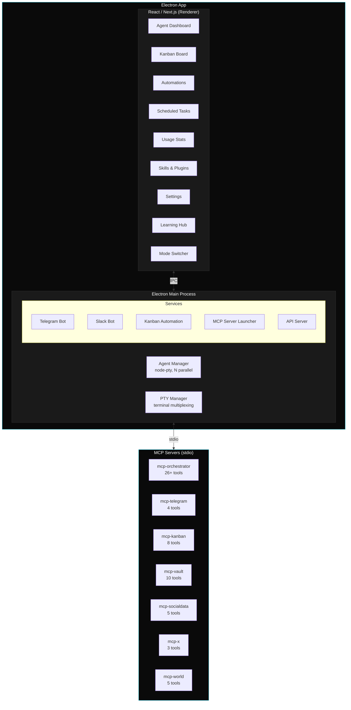
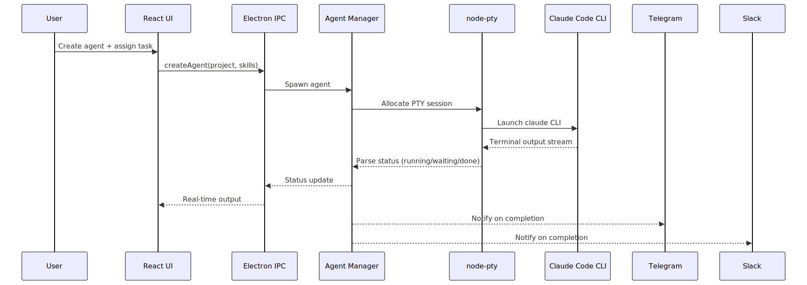
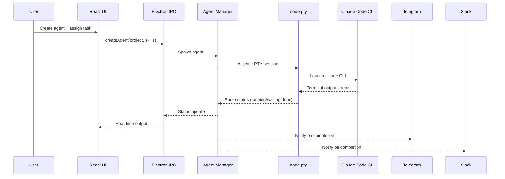
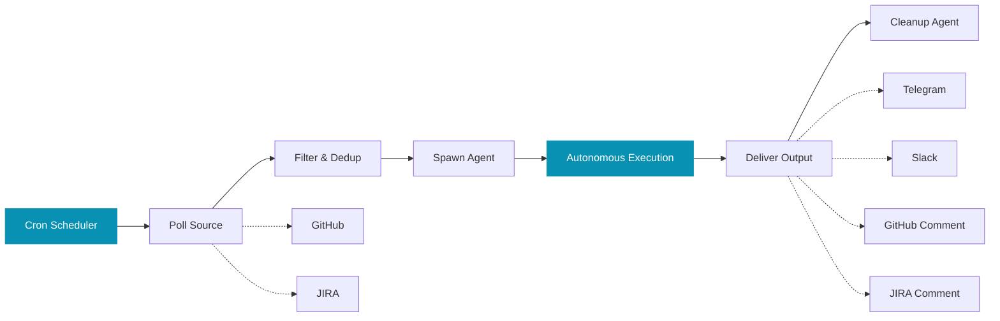
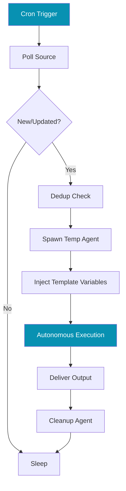

# GRIP Commander


Cross-domain knowledge work engine. Deploy, monitor, and orchestrate AI agents from one interface.

**Electron 33 + Next.js 16 + React 19 + 7 MCP Servers**

[](https://github.com/CodeTonight-SA/GRIP-GUI/releases)
[](LICENSE)
[](https://github.com/CodeTonight-SA/GRIP-GUI/actions)


---

## Table of Contents

- [Download](#download)
- [Why GRIP Commander](#why-grip-commander)
- [Architecture](#architecture)
- [Core Features](#core-features)
- [MCP Servers](#mcp-servers)
- [Automations](#automations)
- [Remote Control](#remote-control)
- [Installation](#installation)
- [Project Structure](#project-structure)
- [Tech Stack](#tech-stack)
- [Configuration](#configuration)
- [Development](#development)
- [Contributing](#contributing)
- [License](#license)

---

## Download

| Platform | Architecture | Status | Link |
|----------|-------------|--------|------|
| macOS | ARM64 (Apple Silicon) | Alpha | [Download DMG](https://github.com/CodeTonight-SA/GRIP-GUI/releases/download/v0.1.0-alpha.1/GRIP-Commander-0.1.0-arm64.dmg) |
| macOS | Intel | Planned | — |
| Windows | x64 | Planned | — |
| Linux | x64 | Planned | — |

> **macOS Gatekeeper:** This alpha is unsigned. After installing, run:
> ```bash
> xattr -cr /Applications/GRIP\ Commander.app
> ```
> Or right-click the app, select Open, then click Open in the dialog.

---

## Why GRIP Commander

Claude Code runs one agent at a time, in one terminal. GRIP Commander removes that limitation:

- **Run 10+ agents simultaneously** across different projects and codebases
- **Automate agent workflows** — trigger agents on GitHub PRs, JIRA issues, and external events
- **Delegate and coordinate** — a Super Agent orchestrates other agents via MCP tools
- **Manage tasks visually** — Kanban board with automatic agent assignment
- **Schedule recurring work** — cron-based tasks that run autonomously
- **Control from anywhere** — Telegram and Slack integration for remote management
- **Learn and explore** — onboarding wizard, concept deep-dives, mode switching

---

## Architecture

### System Overview



<details>
<summary>Mermaid source</summary>



</details>

### Agent Execution Flow



<details>
<summary>Mermaid source</summary>



</details>

### Automation Pipeline



<details>
<summary>Mermaid source</summary>



</details>

---

## Core Features

### Parallel Agent Management

Run multiple Claude Code agents simultaneously, each in its own isolated PTY terminal session.


- Spawn unlimited concurrent agents across multiple projects
- Each agent runs in an isolated terminal with full PTY support
- Assign skills, model selection (sonnet, opus, haiku), and project context per agent
- Real-time terminal output streaming
- Agent lifecycle: `idle` → `running` → `completed` / `error` / `waiting`
- Git worktree support for branch-isolated development
- Persistent agent state across app restarts
- Autonomous execution mode for unattended operation

### Super Agent (Orchestrator)

A meta-agent that programmatically controls all other agents. Give it a high-level task and it delegates, monitors, and coordinates the work.


- Creates, starts, and stops agents via MCP tools
- Delegates tasks based on agent capabilities
- Monitors progress, captures output, handles errors
- Responds to Telegram and Slack messages for remote orchestration

### Kanban Task Management

Task board integrated with the agent system. Tasks flow through columns and can be automatically assigned to agents based on skill matching.


```
Backlog → Planned → Ongoing → Done
```

- Priority levels, progress tracking, labels
- Skill-based automatic agent assignment
- Self-managing task pipeline — add tasks, agents pick them up

### Learning Hub

Onboarding wizard and concept deep-dives for understanding the GRIP ecosystem.

- 5 core concepts with interactive walkthroughs
- Asymmetric 3+9 grid layout for concept deep-dives
- Mode switcher (31 operating modes, multi-select up to 3)

### Usage Tracking

Monitor Claude Code API usage across all agents — token consumption, cost tracking, activity patterns.


### Skills & Plugin System

Extend agent capabilities with skills from [skills.sh](https://skills.sh).


- Code Intelligence: LSP plugins for TypeScript, Python, Rust, Go
- External Integrations: GitHub, GitLab, Jira, Figma, Slack, Vercel
- Install skills per-agent for specialised task handling

### Vault

Persistent document storage that agents can read, write, and search across sessions.


- Markdown documents with title, content, tags, file attachments
- Folder organisation with nested hierarchies
- Full-text search powered by SQLite FTS5
- Cross-agent access

---

## MCP Servers

GRIP Commander bundles **7 MCP servers** with **60+ tools** for programmatic agent control.

### mcp-orchestrator (26+ tools)

Agent management, messaging, scheduling, and automations.

<details>
<summary>Agent Management Tools</summary>

| Tool | Description |
|------|-------------|
| `list_agents` | List all agents with status |
| `get_agent` | Get detailed agent info |
| `get_agent_output` | Read agent terminal output |
| `create_agent` | Create a new agent |
| `start_agent` | Start agent with a task |
| `send_message` | Send input to running agent |
| `stop_agent` | Terminate a running agent |
| `remove_agent` | Permanently delete agent |
| `wait_for_agent` | Poll until completion |

</details>

<details>
<summary>Scheduler & Automation Tools</summary>

| Tool | Description |
|------|-------------|
| `list_scheduled_tasks` | List recurring tasks |
| `create_scheduled_task` | Create recurring task (cron) |
| `delete_scheduled_task` | Remove scheduled task |
| `run_scheduled_task` | Execute immediately |
| `list_automations` | List all automations |
| `create_automation` | Create automation pipeline |
| `run_automation` | Trigger immediately |
| `pause_automation` / `resume_automation` | Control automation state |
| `send_telegram` / `send_slack` | Send messages |

</details>

### mcp-telegram (4 tools)

Telegram messaging with media support: text, photos, videos, documents.

### mcp-kanban (8 tools)

Programmatic Kanban task management: create, move, assign, complete tasks.

### mcp-vault (10 tools)

Document management: create, update, search, attach files, folder organisation.

### mcp-socialdata (5 tools)

Twitter/X data via [SocialData API](https://socialdata.tools): search tweets, user profiles, engagement metrics.

### mcp-x (3 tools)

Twitter/X posting: create tweets, reply, delete.

### mcp-world (5 tools)

Generative game worlds: create zones, manage NPCs, update signs, list sprites.

---

## Automations

Poll external sources, detect new items, spawn Claude agents to process each item autonomously.

| Source | Status |
|--------|--------|
| GitHub | Active (PRs, issues, releases via `gh` CLI) |
| JIRA | Active (REST API v3) |
| Pipedrive | Planned |
| Twitter | Planned |
| RSS | Planned |

### Pipeline



### Template Variables

Use `{{variable}}` syntax in agent prompts:

**GitHub:** `{{title}}`, `{{url}}`, `{{author}}`, `{{body}}`, `{{labels}}`, `{{repo}}`, `{{number}}`, `{{type}}`

**JIRA:** `{{key}}`, `{{summary}}`, `{{status}}`, `{{issueType}}`, `{{priority}}`, `{{assignee}}`, `{{reporter}}`, `{{url}}`, `{{body}}`

---

## Remote Control

### Telegram

Control your agent fleet from Telegram. Send `/status`, `/agents`, `/start_agent <name> <task>`, `/stop_agent <name>`, `/ask <message>`, or any free-form message to the Super Agent.

**Setup:** Create a bot via [@BotFather](https://t.me/botfather), paste the token in Settings, send `/start` to register.

### Slack

Same capabilities via @mentions or DMs. Socket Mode (no public URL needed).

**Setup:** Create app at [api.slack.com/apps](https://api.slack.com/apps), enable Socket Mode, add OAuth scopes (`app_mentions:read`, `chat:write`, `im:history`, `im:read`, `im:write`), subscribe to events (`app_mention`, `message.im`).

---

## Installation

### Download (Recommended)

Download the [latest release](https://github.com/CodeTonight-SA/GRIP-GUI/releases) and install.

> **macOS Gatekeeper:** `xattr -cr /Applications/GRIP\ Commander.app`

### Prerequisites (Build from Source)

- Node.js 18+
- Claude Code CLI: `npm install -g @anthropic-ai/claude-code`
- GitHub CLI (`gh`) for automations

### Build from Source

```bash
git clone https://github.com/CodeTonight-SA/GRIP-GUI.git
cd GRIP-GUI
npm install
npx @electron/rebuild
npm run electron:dev          # Development mode
npm run electron:build        # Production build (signed DMG)
npm run commander:dmg         # Unsigned DMG (alpha)
npm run commander:pack        # Unsigned .app directory
```

### Web Browser (No Electron)

```bash
npm install
npm run dev
```

Open [http://localhost:3000](http://localhost:3000). Agent management requires the Electron app.

---

## Project Structure

```
grip-gui/
├── src/                           # Next.js frontend
│   ├── app/                       # App Router pages
│   │   ├── page.tsx               # Engine (chat interface)
│   │   ├── agents/                # Agent management
│   │   ├── kanban/                # Kanban board
│   │   ├── automations/           # Automation management
│   │   ├── recurring-tasks/       # Scheduled tasks
│   │   ├── modes/                 # Mode switcher (31 modes)
│   │   ├── learn/                 # Learning hub + onboarding
│   │   ├── vault/                 # Document management
│   │   ├── skills/                # Skills marketplace
│   │   ├── usage/                 # Usage statistics
│   │   ├── settings/              # Configuration
│   │   └── api/                   # Backend API routes
│   ├── components/                # React components
│   ├── hooks/                     # Custom React hooks
│   ├── lib/                       # Data definitions
│   └── store/                     # Zustand state management
├── electron/                      # Electron main process
│   ├── main.ts                    # Entry point
│   ├── preload.ts                 # IPC bridge
│   ├── core/                      # Agent, PTY, window managers
│   ├── services/                  # Telegram, Slack, API, MCP
│   └── handlers/                  # IPC handlers
├── mcp-orchestrator/              # Orchestration server (26+ tools)
├── mcp-telegram/                  # Telegram media server (4 tools)
├── mcp-kanban/                    # Kanban server (8 tools)
├── mcp-vault/                     # Vault server (10 tools)
├── mcp-socialdata/                # Twitter/X data server (5 tools)
├── mcp-x/                         # Twitter/X posting server (3 tools)
└── mcp-world/                     # Generative worlds server (5 tools)
```

---

## Tech Stack

| Category | Technology | Version |
|----------|-----------|---------|
| Framework | Next.js (App Router) | 16 |
| Frontend | React | 19 |
| Desktop | Electron | 33 |
| Styling | Tailwind CSS | 4 |
| State | Zustand | 5 |
| Animations | Framer Motion | 12 |
| Terminal | xterm.js + node-pty | 5 / 1.1 |
| Database | better-sqlite3 | 11 |
| MCP | @modelcontextprotocol/sdk | 1.0 |
| Language | TypeScript | 5 |

---

## Configuration

### Settings Files

| File | Purpose |
|------|---------|
| `~/.grip/app-settings.json` | App settings (tokens, preferences) |
| `~/.grip/agents.json` | Persisted agent state |
| `~/.grip/kanban-tasks.json` | Kanban board tasks |
| `~/.grip/automations.json` | Automation definitions |
| `~/.grip/vault.db` | Vault documents (SQLite) |
| `~/.claude/settings.json` | Claude Code settings |
| `~/.claude/schedules.json` | Scheduled task definitions |

---

## Development

```bash
npm run dev              # Next.js dev server
npm run electron:dev     # Electron + Next.js dev mode
npm run build            # Production build
npm run electron:build   # Distributable (signed DMG)
npm run commander:dmg    # Unsigned DMG (alpha distribution)
npm run commander:pack   # Unsigned .app (development)
npm run test             # Run tests (vitest)
npm run lint             # ESLint
```

---

## Contributing

Contributions are welcome. Please submit a Pull Request.

1. Fork the repository
2. Create a feature branch (`git checkout -b feature/my-feature`)
3. Commit your changes
4. Push and open a Pull Request

---

## License

MIT License. See [LICENSE](LICENSE) for details.

---

## Acknowledgements

- [Anthropic](https://anthropic.com) for Claude Code
- [skills.sh](https://skills.sh) for the skills ecosystem
- Built with [GRIP](https://grip-preview.vercel.app) — the AI operating system
